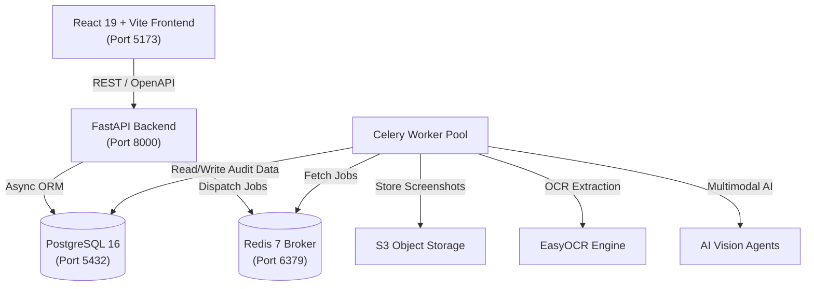

# System Architecture Specification

## Overview

**UXOps AI** is an enterprise-grade AI UI/UX quality engineering platform designed for continuous visual auditing, automated design regression testing, and accessibility compliance. The system uses a microservice architecture comprising an asynchronous FastAPI backend, a Celery task processing cluster backed by Redis, a PostgreSQL database for relational persistent data, S3 object storage for UI screenshots, and a React 19 + TypeScript frontend.

---

## Key Subsystems

### 1. Web & API Layer (`/backend`)
* **Framework**: FastAPI (Async Python 3.12).
* **Role**: Handles client requests, user authentication, RBAC authorization, workspace tenant isolation, file upload ingestion, and audit status polling.
* **OpenAPI Specs**: Interactive documentation auto-generated at `/docs` (Swagger) and `/redoc`.

### 2. Authentication & Multi-Tenancy (`/backend/auth`, `/backend/database`)
* **Authentication**: OAuth2 Password Flow with Bearer JWT tokens signed using HMAC-SHA256.
* **Workspace Isolation**: Multi-tenant architecture where every user belongs to one or more workspaces. Database queries for audit results and workspace resources are strictly scoped by `workspace_id`.
* **RBAC Roles**:
  * `owner`: Workspace creator with full administrative and billing control.
  * `admin`: Workspace administrator with full read/write/member management privileges.
  * `member`: Standard user capable of triggering audits, creating reports, and viewing results.
  * `viewer`: Read-only access to audit reports and analytics dashboard.

### 3. Distributed Task Engine (`/backend/common/celery_app.py`)
* **Task Broker**: Redis 7.
* **Worker Cluster**: Celery 5.4 distributed worker pool.
* **Responsibilities**:
  * Long-running visual audit execution.
  * EasyOCR image processing and spatial bounding box extraction.
  * Deterministic design rule evaluations (contrast ratio, typography scaling, grid alignment).
  * Multimodal LLM vision prompting and grounding.
  * PDF report compilation (`/backend/pdf/`).

### 4. Data Layer (`/backend/database`)
* **Relational Store**: PostgreSQL 16.
* **ORM**: SQLAlchemy 2.0 with `asyncpg` async driver.
* **Migrations**: Managed via Alembic (`/backend/alembic.ini`).
* **Entity Identifiers**: Universally Unique Identifiers (UUID v4) for all entity primary keys.
* **Audit Columns**: Automated `created_at` and `updated_at` timestamps on all schema models.

### 5. Frontend Client (`/frontend`)
* **Stack**: React 19, TypeScript, Vite.
* **Routing**: Client-side single page navigation.
* **Linting**: Oxlint for high-speed static analysis.

---

## Data Flow: Visual Audit Pipeline

1. **Upload**: User uploads a web/mobile UI screenshot via the React frontend to `POST /api/v1/workspaces/{workspace_id}/audits`.
2. **Ingestion**: FastAPI validates user workspace permissions, stores the image asset in Object Storage (S3/local storage), and creates an `Audit` record with status `PENDING`.
3. **Dispatch**: FastAPI enqueues a Celery task `run_visual_audit_task(audit_id)`.
4. **Execution**:
   - Celery worker pulls the task from Redis.
   - Worker triggers EasyOCR to extract text labels and spatial bounding coordinates.
   - Worker runs deterministic spacing/alignment analysis algorithms (`/backend/analysis/`).
   - Worker invokes multimodal vision prompt templates (`/backend/prompts/`) to evaluate visual hierarchy and design system compliance.
5. **Completion**: Audit findings are saved to PostgreSQL, and the status is updated to `COMPLETED`.
6. **Reporting**: Frontend polls `GET /api/v1/workspaces/{workspace_id}/audits/{audit_id}` or receives notification when complete.

---

## Architecture Decision Records (ADRs)

Detailed records of key architectural choices:
* [ADR 0001: Project Setup and Developer Workflow](file:///Volumes/Element/Projects/AI/UXOps-AI/docs/ADR/0001-project-setup-and-dev-workflow.md)
* [ADR 0002: Authentication and Multi-Tenancy Strategy](file:///Volumes/Element/Projects/AI/UXOps-AI/docs/ADR/0002-authentication-and-multi-tenancy.md)
